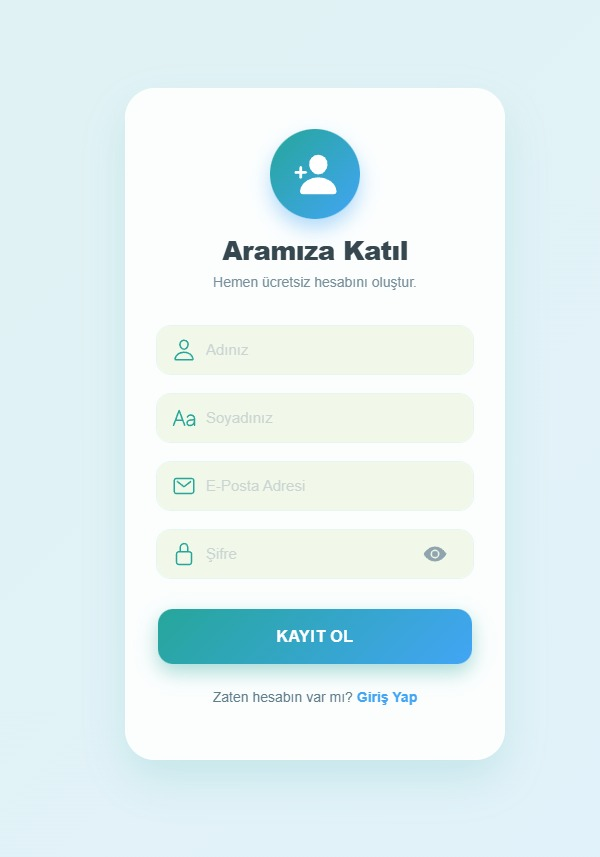
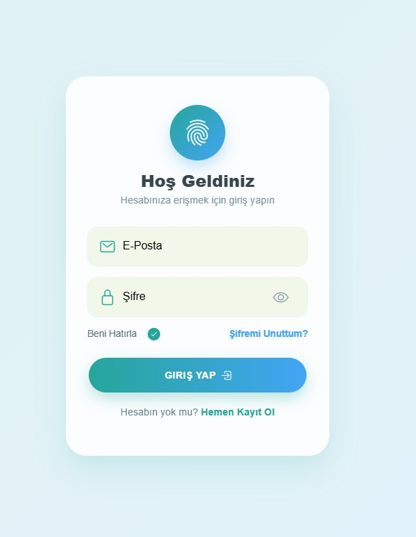

# 🎬 Filmlerim - Kişisel Film Arşivi Uygulaması

Bu proje, **Ankara Üniversitesi - Mobil Programlama I** dersi final ödevi olarak geliştirilmiştir. **Ionic Framework** ve **Firebase** teknolojileri kullanılarak, kullanıcıların izledikleri veya izleyecekleri filmleri kaydedebilecekleri, puanlayabilecekleri ve yönetebilecekleri bulut tabanlı bir mobil uygulamadır.

## 📱 Proje Hakkında

Uygulama, modern **Glassmorphism** tasarım dili kullanılarak geliştirilmiştir. Her kullanıcı kendi e-posta ve şifresi ile güvenli giriş yapar ve veriler (filmler) tamamen kullanıcıya özel (User-Specific) olarak Firestore veritabanında saklanır.

### ✨ Temel Özellikler

* **🔐 Kimlik Doğrulama:** Firebase Auth ile güvenli Kayıt Ol (Register), Giriş Yap (Login) ve Çıkış Yap (Logout) işlemleri.
* **☁️ Bulut Tabanlı Kayıt:** Tüm veriler Firebase Firestore üzerinde anlık olarak saklanır.
* **📝 CRUD İşlemleri:**
    * Film Ekleme (Ad, Tür, Yıl, Açıklama).
    * Film Listeleme (Anlık veri akışı).
    * Film Düzenleme & Puanlama (Yıldız sistemi).
    * Film Silme (Kaydırarak veya buton ile).
* **⭐ Favori ve İzlenecekler:** Filmleri "Favori" veya "İzlenecek" olarak işaretleme.
* **🎨 Modern Arayüz:** CSS Gradientler ve Glassmorphism kart tasarımları.

## 📸 Ekran Görüntüleri

| Kayıt Ol (Register) | Giriş Yap (Login) | Ana Sayfa (Home) |
|:---:|:---:|:---:|
|  |  |  |
*(Ekran görüntüleri `screenshots` klasörü altındadır)*

## 🛠️ Kullanılan Teknolojiler

* **Framework:** [Ionic 7](https://ionicframework.com/) (Angular ile)
* **Dil:** TypeScript
* **Veritabanı:** Firebase Firestore
* **Kimlik Doğrulama:** Firebase Authentication
* **Editör:** VS Code

## 🚀 Kurulum ve Çalıştırma

Bu projeyi kendi bilgisayarınızda çalıştırmak için:

1.  Projeyi klonlayın:
    ```bash
    git clone [https://github.com/hamdiiahmett/ionic-film-arsivi.git](https://github.com/hamdiiahmett/ionic-film-arsivi.git)
    ```
2.  Proje klasörüne gidin:
    ```bash
    cd ionic-film-arsivi
    ```
3.  Gerekli paketleri yükleyin:
    ```bash
    npm install
    ```
4.  Uygulamayı tarayıcıda başlatın:
    ```bash
    ionic serve
    ```

## 👤 Hazırlayan

**Ad Soyad:** Ahmet Hamdi Oğuz  
**Bölüm:** Bilgisayar Programcılığı  
**Ders:** Mobil Programlama I  

---
*2026 - Ankara Üniversitesi*